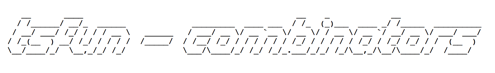

                                            

**tsfun - functional combinator library for TypeScript**

see also: [tsfun-extra](https://github.com/danielmarreirosdeoliveira/tsfun-extra), [tsfun-core](https://github.com/danielmarreirosdeoliveira/tsfun-core)

---

## Function reference

### Predicate

* [has](test/predicate/has.spec.ts) 
* [hasNot](test/predicate/has_not.spec.ts) 
* [isEmpty](https://github.com/danielmarreirosdeoliveira/tsfun-core/blob/master/test/predicate/is_empty.spec.ts)
* [empty](test/predicate/empty.spec.ts)
* [isUndefinedOrEmpty](https://github.com/danielmarreirosdeoliveira/tsfun-core/blob/master/test/predicate/is_undefined_or_empty.spec.ts)
* [undefinedOrEmpty](test/predicate/undefined_or_empty.spec.ts)
* [isDefined](https://github.com/danielmarreirosdeoliveira/tsfun-core/blob/master/test/predicate/is_defined.spec.ts)
* [defined](test/predicate/defined.spec.ts)
* [isUndefined](https://github.com/danielmarreirosdeoliveira/tsfun-core/blob/master/test/predicate/is_undefined.spec.ts)
* [isArray](https://github.com/danielmarreirosdeoliveira/tsfun-core/blob/master/test/predicate/is_array.spec.ts)
* [isObject](https://github.com/danielmarreirosdeoliveira/tsfun-core/blob/master/test/predicate/is_object.spec.ts)
* [isNot](https://github.com/danielmarreirosdeoliveira/tsfun-core/blob/master/test/predicate/is_not.spec.ts)
* [not](test/predicate/not.spec.ts)
* [and](test/predicate/and.spec.ts)
* [or](test/predicate/or.spec.ts)
* [xor](test/predicate/xor.spec.ts)

### Comparator

* [tripleEqual](test/comparator/triple_equal.spec.ts)
* [jsonEqual](test/comparator/json_equal.spec.ts)
* [is](test/comparator/is.spec.ts)
* [isnt](test/comparator/isnt.spec.ts)
* [differentFrom](https://github.com/danielmarreirosdeoliveira/tsfun-core/blob/master/test/comparator/different_from.spec.ts)
* [includedIn](https://github.com/danielmarreirosdeoliveira/tsfun-core/blob/master/test/comparator/included_in.spec.ts)
* [subsetOf](https://github.com/danielmarreirosdeoliveira/tsfun-core/blob/master/test/comparator/subset_of.spec.ts)
* [supersetOf](https://github.com/danielmarreirosdeoliveira/tsfun-core/blob/master/test/comparator/superset_of.spec.ts)
* [sameset](https://github.com/danielmarreirosdeoliveira/tsfun-core/blob/master/test/comparator/sameset.spec.ts)
* [arrayEqual](https://github.com/danielmarreirosdeoliveira/tsfun-core/blob/master/test/comparator/array_equal.spec.ts)
* [objectEqual](https://github.com/danielmarreirosdeoliveira/tsfun-core/blob/master/test/comparator/object_equal.spec.ts)
* [equal](https://github.com/danielmarreirosdeoliveira/tsfun-core/blob/master/test/comparator/equal.spec.ts)
* [equalTo](https://github.com/danielmarreirosdeoliveira/tsfun-core/blob/master/test/comparator/equal_to.spec.ts)
* [on](https://github.com/danielmarreirosdeoliveira/tsfun-core/blob/master/test/comparator/on.spec.ts)

### Composition

* [flow](test/composition/flow.spec.ts)
* [compose](test/composition/compose.spec.ts)
* [cond](test/composition/cond.spec.ts)
* [identity](https://github.com/danielmarreirosdeoliveira/tsfun-core/blob/master/test/composition/identity.spec.ts)
* [val](https://github.com/danielmarreirosdeoliveira/tsfun-core/blob/master/test/composition/val.spec.ts)
* [nop](https://github.com/danielmarreirosdeoliveira/tsfun-core/blob/master/test/composition/nop.spec.ts)

### List

* [copy](test/arraylist/copy.spec.ts)
* arrayList
* [len](test/arraylist/len.spec.ts)
* [range](test/arraylist/range.spec.ts)
* [append](test/arraylist/append.spec.ts) 
* [prepend](test/arraylist/prepend.spec.ts) 
* [map](test/arraylist/map.spec.ts)
* [filter](test/arraylist/filter.spec.ts) 
* [remove](test/arraylist/remove.spec.ts)
* [count](test/arraylist/count.spec.ts)
* [forEach](test/arraylist/for_each.spec.ts)
* [forEachRight](test/arraylist/for_each_right.spec.ts) 
* [reduce](test/arraylist/reduce.spec.ts)
* [flatMap](test/arraylist/flat_map.spec.ts)
* [flatten](test/arraylist/flatten.spec.ts)
* [take](test/arraylist/take.spec.ts)
* [takeRight](test/arraylist/take_right.spec.ts)
* [takeNth](test/arraylist/take_nth.spec.ts)
* [takeWhile](test/arraylist/take_while.spec.ts)
* [takeRightWhile](test/arraylist/take_right_while.spec.ts)
* [drop](test/arraylist/drop.spec.ts)
* [dropRight](test/arraylist/drop_right.spec.ts)
* [dropWhile](test/arraylist/drop_while.spec.ts)
* [dropRightWhile](test/arraylist/drop_right_while.spec.ts)
* [apply](test/arraylist/apply.spec.ts) 
* [separate](test/arraylist/separate.spec.ts) 
* [first](test/arraylist/first.spec.ts)
* [second](test/arraylist/second.spec.ts)
* [last](test/arraylist/last.spec.ts)
* [nth](test/arraylist/nth.spec.ts)
* [nthOr](test/arraylist/nth_or.spec.ts)
* [indices](test/arraylist/indices.spec.ts)
* [zip](test/arraylist/zip.spec.ts)
* [zipWith](test/arraylist/zip_with.spec.ts)

### Set

* [intersection](https://github.com/danielmarreirosdeoliveira/tsfun-core/blob/master/test/arrayset/intersection.spec.ts)
* [intersect](https://github.com/danielmarreirosdeoliveira/tsfun-core/blob/master/test/arrayset/intersect.spec.ts)
* [subtract](https://github.com/danielmarreirosdeoliveira/tsfun-core/blob/master/test/arrayset/subtract.spec.ts)
* [union](https://github.com/danielmarreirosdeoliveira/tsfun-core/blob/master/test/arrayset/union.spec.ts)
* [unite](https://github.com/danielmarreirosdeoliveira/tsfun-core/blob/master/test/arrayset/unite.spec.ts)
* [unique](https://github.com/danielmarreirosdeoliveira/tsfun-core/blob/master/test/arrayset/unique.spec.ts)
* [duplicates](test/arrayset/duplicates.spec.ts)

### Associative

* [keysAndValues](test/associative/keys_and_values.spec.ts)
* [keys](test/associative/keys.spec.ts)
* [values](test/associative/values.spec.ts)
* [lookup](test/associative/lookup.spec.ts)

### Associative | Struct

* [assoc](test/struct/assoc.spec.ts)
* [dissoc](test/struct/dissoc.spec.ts)
* [update](test/struct/update.spec.ts)

### Struct

* [to](test/struct/to.spec.ts)
* [getOn](test/struct/get_on.spec.ts)
* [getOnOr](test/struct/get_on_or.spec.ts)
* [setOn](test/struct/set_on.spec.ts)
* [clone](test/struct/clone.spec.ts)
* [jsonClone](test/struct/json_clone.spec.ts)

## Credits 
 
Ascii Art generated with http://www.patorjk.com/software/taag

